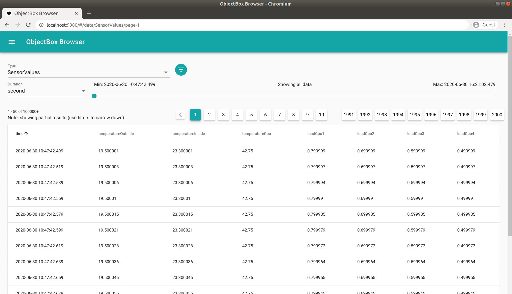
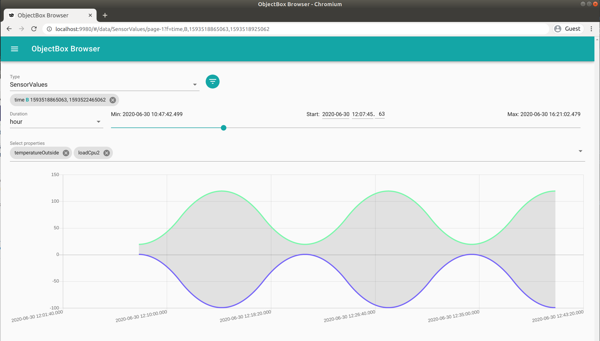

ObjectBox TS (Time Series) Demo
===============================
**ObjectBox TS** offers additional time series functionality over the standard ObjectBox database.
This allows very efficient processing of time based data, while still offering object based persistence.

This demo shows how to develop with ObjectBox TS using C++ (contact us for other languages).
While its usage is very similar to standard ObjectBox, it comes with superior performance for time based data.

Run the TS Demo
---------------
**In order to run this demo, you need to get the [ObjectBox TS library from objectbox.io](https://objectbox.io/time-series-database/).**
The [CMake build build](CMakeLists.txt) expects the library (e.g. libobjectbox.so) in `lib/` in the project directory.

If you do not have the TS library yet, you can test the build with the standard (non-TS) ObjectBox library by running `./setup.sh`.

At this point you should be able to run the demo in a CMake aware IDE.
Or, if you prefer the command line, run these commands to build and run the demo:

    cmake .
    make
    ./objectbox_ts_demo

Time Series data type
---------------------
This example stores data from sensors at a specific time in a type called `SensorValues`.
This type is defined in the file [ts-data-model.fbs](ts-data-model.fbs) like this:

```
table SensorValues {
    id: ulong;

    /// objectbox:id-companion,date
    time: long;

    temperatureOutside: double;
    temperatureInside: double;
    // ...
}
```

Please pay special attention to the `time` property and that it is annotated by `/// objectbox:id-companion,date`.
This specific annotation makes `SensorValues` a TS type and thus enables time series functionality for it.

And by the way, the mentioned .fbs file is a FlatBuffers schema definition,
which is also used by [ObjectBox Generator](https://github.com/objectbox/objectbox-generator).
The latter generates the `SensorValues` C++ struct and binding code to enable `obx::Box<SensorValues>`.   
 
Storing Time Series data
------------------------
All (non-generated) source code is contained in the [main.cpp](src/main.cpp) file.
As you will see, storing time series data is no different from storing other object data.
Using a templated `obx::Box`, it's a single call to `put()`:

    std::vector<SensorValues> values = createSensorValueData(now, dataCount);
    boxSV.put(values);

Note that `createSensorValueData()` creates dummy sensor data, which is mostly unrelated to ObjectBox.
The single special thing here is that the `SensorValues.id` member is set to `OBX_ID_NEW` to mark it as an new object.

Get the minimum and maximum time values
---------------------------------------
Often, you want to know the minimum and/or maximum time values of the stored data.
For ObjectBox TS, this is a very efficient look up.  
In the [main.cpp](src/main.cpp) file, you will find an example in the `printMinMaxTime()` function:

    int64_t timeMin{0}, timeMax{0};
    box.timeSeriesMinMax(nullptr, &timeMin, nullptr, &timeMax);

There's also an overload of `timeSeriesMinMax()` accepting a time range (begin and end time) within to look for min/max values.

Querying Time Series data
-------------------------
TS enabled types can accessed just like other types.
For example, `obx::Box::get(id)` returns an object for the given ID.
Queries also work as usual. With one pleasant exception: time based queries perform much faster.
The runtime behavior of queries using time series properties is similar to queries using indexed properties,
but without requiring extra storage for index data.
Thus, TS queries scale very well with a high number of objects because they avoid scanning all objects.  

In [main.cpp](src/main.cpp), there's a function `buildAndRunQueries()`, which shows two queries in action.
Using the standard query builder approach, we add a "between" condition on the `time` property associated with "SensorValues".
It queries for `SensorValues` in the time range from "1 second since start" until "2 seconds since start":    

    obx::QueryBuilder<SensorValues> qbRange = box.query();
    obx_qb_int_between(qbRange.cPtr(), SensorValues_::time, start + 1000, start + 1999);
    obx::Query<SensorValues> query = qbRange.build();
    std::vector<std::unique_ptr<SensorValues>> result = query.find();
    
### Query with time links

The second query also returns object in a time range.
But instead of specifying the time range directly, we want to refer to a time range defined in another type.
Let's have another look at [ts-data-model.fbs](ts-data-model.fbs) to locate the `NamedTimeRange` type:

```
table NamedTimeRange {
    id: ulong;

    /// objectbox:date
    begin: long;

    /// objectbox:date
    end: long;

    name: string;
}
```

This type is an example for how to dynamically define time ranges.
In the function `putAndPrintNamedTimeRanges()`, we put two time ranges into the database.
One called "green" and the other called "red".

So now let's query for all `SensorValues` objects that fall in the time range of the `NamedTimeRange` instance called "green".
To do so, we need to define a "link" between these two types.
As this link is time based, we need to tell ObjectBox which properties define the time range (begin and end time).

    obx::QueryBuilder<SensorValues> qbLink = box.query();
    obx::QueryBuilder<NamedTimeRange> qbNamedTimeRange =
        qbLink.linkTime<NamedTimeRange>(NamedTimeRange_::entityId(), NamedTimeRange_::begin, NamedTimeRange_::end);
    obx_qb_string_equal(qbNamedTimeRange.cPtr(), NamedTimeRange_::name, "green", true);

Note, that the result of linking to `NamedTimeRange` results in a `QueryBuilder<NamedTimeRange>`.
Thus, the scope of that query builder is `NamedTimeRange` and we can define query criteria for `NamedTimeRange`.
This is what we do in the last line (`obx_qb_string_equal()`) to match against the "green" time range.

Next steps
----------
This example project showed how to get started with ObjectBox TS and its very efficient time series functionality. 
Want more? Just reach out to us using the [ObjectBox TS web page](https://objectbox.io/time-series-database/).
We're happy to learn about your individual use case and how ObjectBox TS can help you. 

### Object Browser TS

Please contact us if you are interested in the time series enabled data object browser.
Here are some screenshots to give you a first impression:





License
-------
    Copyright 2021 ObjectBox Ltd. All rights reserved.
    
    Licensed under the Apache License, Version 2.0 (the "License");
    you may not use this file except in compliance with the License.
    You may obtain a copy of the License at
    
        http://www.apache.org/licenses/LICENSE-2.0
    
    Unless required by applicable law or agreed to in writing, software
    distributed under the License is distributed on an "AS IS" BASIS,
    WITHOUT WARRANTIES OR CONDITIONS OF ANY KIND, either express or implied.
    See the License for the specific language governing permissions and
    limitations under the License.
